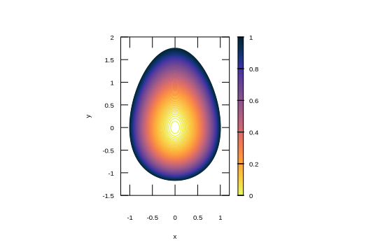

```julia
using Gnuplot, Random
Random.seed!(123)
let
    x = -1:0.05:1
    y = -1.5:0.05:2
    egg(x,y) = x^2 + y^2/(1.4 + y/5)^2
    segg = [egg(x,y) for x in x, y in y]
    @gsp x y segg "w l lc palette" palette(:thermal; rev= true) "set view map"
    @gsp :- "set contour base;set key off" "set auto fix"
    @gsp :- "set cntrparam levels incremental  0,0.01,1" "unset surface"
    @gsp :- xrange = (-1.2,1.2) yrange = (-1.5,2) cbrange =(0,1)
    @gsp :- xlab = "x" ylab = "y" "set size ratio -1"
end
```


```
"assets/contour002.svg"
```




