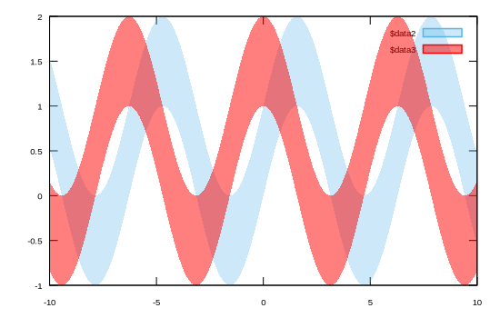

```julia
using Gnuplot
let
    x = LinRange(-10,10,200)
    @gp x sin.(x) sin.(x) .+ 1 "with filledcu lc '#56B4E9' fs transparent solid 0.3"
    @gp :- x cos.(x) 1 .+ cos.(x) "with filledcu lc 'red' fs transparent solid 0.5"
end
```


```
"assets/filled002.svg"
```




