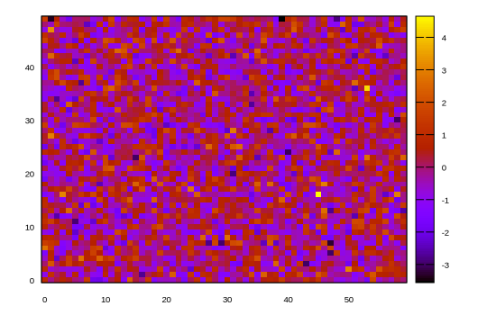

```julia
using Gnuplot
empty!(Gnuplot.options.init)
push!( Gnuplot.options.init, linetypes(:Set1_5, lw=1.5, ps=1.5))
function saveas(file; sx=550, sy=350, fs=0.8, term="svg")
    Gnuplot.save(term="$(term) size $(sx),$(sy) fontscale $(fs)", "$(file).svg")
end;
```


<a id='image-plot'></a>

## image plot


```julia
using Gnuplot, Random
Random.seed!(1234)
matrix = randn(50,60)
@gp matrix "w image pixels notit" "set auto fix"
```


```
"heatmap001.svg"
```




