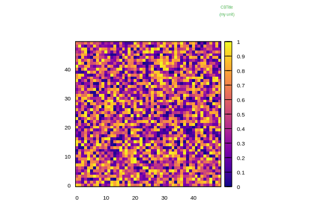

```julia
using Gnuplot, Random
Random.seed!(123)
let
    test = rand(50,50)
    @gp "set auto fix" "set size square" :-
    @gp :- test "w image pixels notit"  """set cblabel "CBTitle \\n (my unit)" """ :-
    @gp :- "set cblabel  offset -6.5, 10 font ',8' textcolor lt 3 rotate by 0" :-
    @gp :- palette(:plasma) :-
    @gp :- "set tmargin at screen 0.80"
end
```


```
"assets/heatmap004.svg"
```




