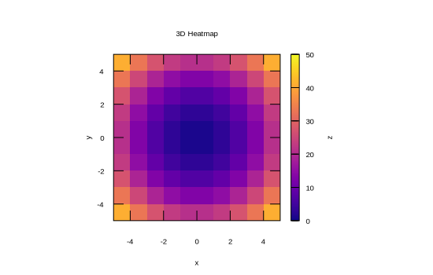

```julia
using Gnuplot, Random
let
    x = y = -5:1:5
    z = [x^2 + y^2 for x in x, y in y]
    @gsp x y z "w pm3d notit" "set view map" "set auto fix" "set size square"
    @gsp :- xlab = "x" ylab = "y" "set cblabel 'z'" palette(:plasma)
    @gsp :- title = "3D Heatmap"
end
```


```
"assets/heatmap002.svg"
```




