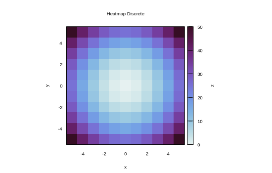

```julia
using Gnuplot
empty!(Gnuplot.options.init)
push!( Gnuplot.options.init, linetypes(:Set1_5, lw=1.5, ps=1.5))
function saveas(file; sx=550, sy=350, fs=0.8, term="svg")
    Gnuplot.save(term="$(term) size $(sx),$(sy) fontscale $(fs)", "$(file).svg")
end;
```


<a id='Heatmap:-discrete'></a>

## Heatmap: discrete


```julia
x = y = -5:1:5
z = [x^2 + y^2 for x in x, y in y]
@gp x y z "w image pixels notit" "set auto fix" "set size square"
@gp :- xlab = "x" ylab = "y" "set cblabel 'z'" palette(:dense)
@gp :- title = "Heatmap Discrete"
saveas("heatmap003");
```




