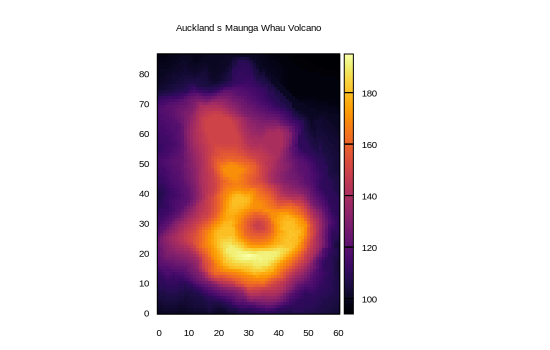

```julia
using Gnuplot, ColorSchemes, RDatasets
let
    volcano = Matrix{Float64}(dataset("datasets", "volcano"))
    @gp title = "Auckland s Maunga Whau Volcano" :-
    @gp :- volcano "w image pixels notit" "set auto fix" "set size ratio -1" palette(:inferno)
end
```


```
"assets/heatmap006.svg"
```




