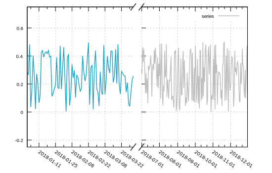

```julia
using Gnuplot
empty!(Gnuplot.options.init)
push!( Gnuplot.options.init, linetypes(:tableau_hue_circle, lw=1.5, ps=1.5))
function saveas(file; sx=550, sy=350, fs=0.8, term="svg")
    Gnuplot.save(term="$(term) size $(sx),$(sy) fontscale $(fs)", "$(file).svg")
end;
```


<a id='Time-series:-Dates,-break-axis-into-2'></a>

## Time series: Dates, break axis into 2


```julia
using Dates

dates = Date(2018, 1, 1):Day(1):Date(2018, 12, 31)
ta = rand(length(dates))
timefmt = "%Y-%m-%d" ## hour:minute:seconds are also available
pfmt = "%Y-%m-%d"
rot_xtics = -35
vals = 0.5*ta
tempo = string.(dates)
xmin1 ="2018-01-01"
xmax1 = "2018-04-01"
xmin2 ="2018-07-01"
xmax2 = "2018-12-31"

@gp "set multiplot; set border 7; set ytics nomirror; set grid" :-
@gp :- "set xdata time" "set timefmt '\"$(timefmt)\"'" :-
@gp :- "set format x '$(pfmt)'" "set xtics rotate by $(rot_xtics)" :-
@gp :- "set tmargin at screen 0.96; set bmargin at screen 0.15" :-
@gp :- "set lmargin at screen 0.1; set rmargin at screen 0.49" :-
@gp :- """set xrange [\'"$(xmin1)\"':\'"$(xmax1)\"']""" yrange = (-0.25,0.75) :-

# set some lines to delimit transition from one half of the plot to next
@gp :- "set arrow from screen 0.51,0.13 to screen 0.53,0.17 nohead" :-
@gp :- "set arrow from screen 0.48,0.13 to screen 0.50,0.17 nohead" :-
@gp :- "set arrow from screen 0.51,0.94 to screen 0.53,0.98 nohead" :-
@gp :- "set arrow from screen 0.48,0.94 to screen 0.50,0.98 nohead" :-

# plot left half
@gp :- tempo vals "u 1:2 w l not" :-
# remove border from left hand side and set ytics on the right
@gp :- 2 "set grid" """set border 13; set format y ""; """

# set left and right margins for right half of the plot
@gp :- "set lmargin at screen 0.52" :-
@gp :- "set rmargin at screen 0.91" :-
# set xrange for right half of the plot
@gp :- """set xrange [\'"$(xmin2)\"':\'"$(xmax2)\"']""" :-
# @gp :- "plot sin(x) axes x1y2"
@gp :-  tempo vals "u 1:2 w l lc 'gray' t 'series'"
saveas("lines007");
```




