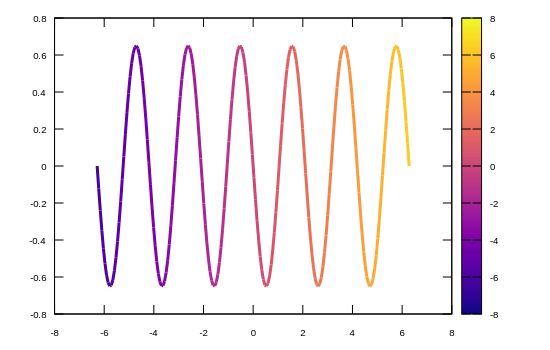

```julia
using Gnuplot
empty!(Gnuplot.options.init)
push!( Gnuplot.options.init, linetypes(:Set1_5, lw=1.5, ps=1.5))
function saveas(file; sx=550, sy=350, fs=0.8, term="svg")
    Gnuplot.save(term="$(term) size $(sx),$(sy) fontscale $(fs)", "$(file).svg")
end;
```


<a id='Line:-colorbar'></a>

## Line: colorbar


```julia
using Gnuplot, ColorSchemes
x = LinRange(-2π,2π,200)
@gp x -0.65sin.(3x) x  "w l notit lw 3 dt 1 lc palette" palette(:plasma)
```


```
"lines005.svg"
```




