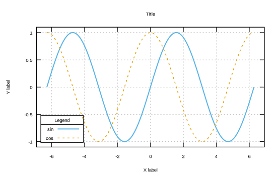

```julia
using Gnuplot
empty!(Gnuplot.options.init)
push!( Gnuplot.options.init, linetypes(:Set1_5, lw=1.5, ps=1.5))
function saveas(file; sx=550, sy=350, fs=0.8, term="svg")
    Gnuplot.save(term="$(term) size $(sx),$(sy) fontscale $(fs)", "$(file).svg")
end;
```


<a id='Lines:-line-style'></a>

## Lines: line style


```julia
x = -2π:0.001:2π
@gp x sin.(x) "w l t 'sin' lw 2 lc '#56B4E9'" "set grid"
@gp :- "set auto fix"
@gp :- "set offsets graph .05, graph .05, graph .05, graph .05"
@gp :- ylabel="Y label" xlabel="X label" title = "Title"
@gp :- "set key bottom left font ',12' title 'Legend' box 2"
@gp :- x cos.(x) "w l t 'cos' lw 1.5 dashtype 2 lc '#E69F00'"
saveas("lines003");
```




