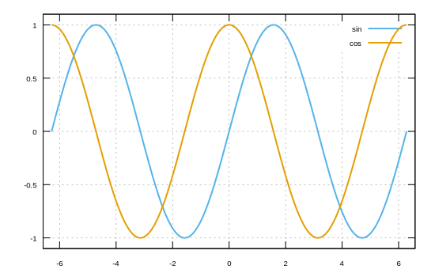

```julia
using Gnuplot
x = -2π:0.001:2π
@gp x sin.(x) "w l t 'sin' lw 2 lc '#56B4E9'" "set grid"
@gp :- xrange = (-2π - 0.3, 2π + 0.3) yrange = (-1.1,1.1)
@gp :- x cos.(x) "w l t 'cos' lw 2 lc rgb '#E69F00'"
```


```
"assets/lines002.svg"
```




