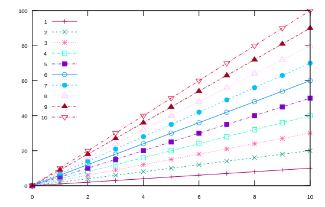

```julia
using Gnuplot
empty!(Gnuplot.options.init)
push!( Gnuplot.options.init, linetypes(:Set1_5, lw=1.5, ps=1.5))
function saveas(file; sx=550, sy=350, fs=0.8, term="svg")
    Gnuplot.save(term="$(term) size $(sx),$(sy) fontscale $(fs)", "$(file).svg")
end;
```


<a id='scatters-lines-and-markers'></a>

## scatters lines and markers


```julia
using ColorSchemes
@gp key="left" linetypes(:mk_12, dashed=true, ps=0.85)
for i in 1:10
    @gp :- i .* (0:10) "w lp t '$i'"
end
```


```julia
saveas("scatter003");
```




