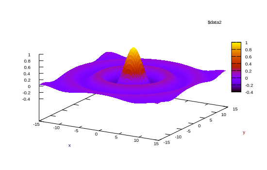

```julia
using Gnuplot, Random
Random.seed!(123)
let
    x = y = -15:0.33:15
    fz(x,y) = sin.(sqrt.(x.^2 + y.^2))./sqrt.(x.^2+y.^2)
    fxy = [fz(x,y) for x in x, y in y]
    @gsp x y fxy "w pm3d" "set ylabel 'y' textcolor rgb 'red'"
    @gsp :- "set xlabel 'x' textcolor rgb 'blue'"
end
```


```
"assets/surface001.svg"
```




