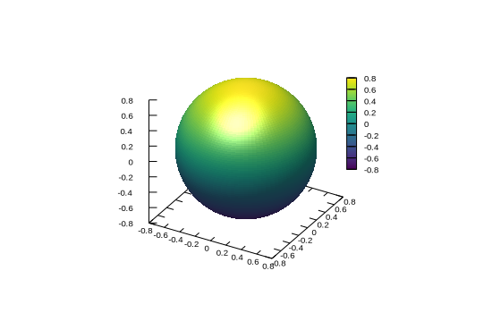

```julia
using Gnuplot, Random
Random.seed!(123)
let
    Θ = LinRange(0, 2π, 100)
    Φ = LinRange(0, π, 100)
    r = 0.8
    x = [r * cos(θ) * sin(ϕ) for θ in Θ, ϕ in Φ]
    y = [r * sin(θ) * sin(ϕ) for θ in Θ, ϕ in Φ]
    z = [r * cos(ϕ) for θ in Θ, ϕ in Φ]
    @gsp "set pm3d depthorder" :-
    @gsp :- "set style fill solid 1.0 noborder" "set view equal xyz"
    @gsp :- "set pm3d lighting primary 0.5 specular 0.6"
    @gsp :-  x y z "w pm3d notit" "set xyplane 0" palette(:viridis)
end
```


```
"assets/surface002.svg"
```




