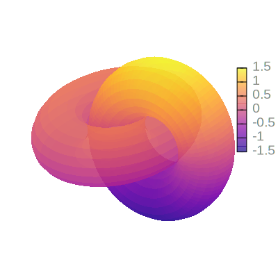

```julia
using Gnuplot
empty!(Gnuplot.options.init)
push!( Gnuplot.options.init, linetypes(:Set1_5, lw=1.5, ps=1.5))
function saveas(file; sx=550, sy=350, fs=0.8, term="svg")
    Gnuplot.save(term="$(term) size $(sx),$(sy) fontscale $(fs)", "$(file).svg")
end;
```


<a id='Interlocking-torus:-depth-sorting'></a>

## Interlocking torus: depth sorting


```julia
U = LinRange(-pi, pi, 100)
V = LinRange(-pi, pi, 20)
@gsp :- "unset key" "unset xtics" "unset ytics" "unset ztics"
@gsp :- "set border 0" "set view 60, 30, 1.5, 0.9"
@gsp :- """set cbtics format "{/*2.0 %h}"""
@gsp :- """set cbtics textcolor rgb "#8c8c8c"""
@gsp :- "set style fill transparent solid 0.7"
@gsp :- palette(:plasma)
@gsp :- "set pm3d depthorder"

x = [cos(u) + .5 * cos(u) * cos(v)      for u in U, v in V]
y = [sin(u) + .5 * sin(u) * cos(v)      for u in U, v in V]
z = [.5 * sin(v)                        for u in U, v in V]
@gsp :-  x' y' z' "w pm3d"

x = [1 + cos(u) + .5 * cos(u) * cos(v)  for u in U, v in V]
y = [.5 * sin(v)                        for u in U, v in V]
z = [sin(u) + .5 * sin(u) * cos(v)      for u in U, v in V]
@gsp :- x' y' z' "w pm3d"
saveas("surface006"; sx=400, sy=400);
```




