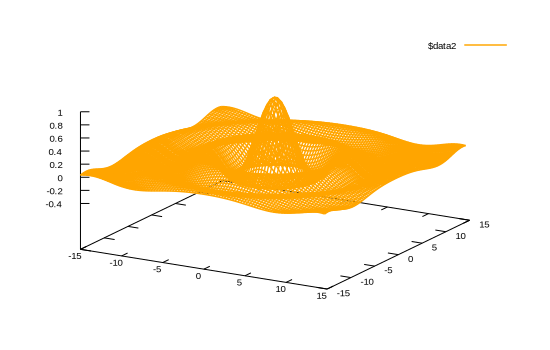

```julia
using Gnuplot
let
    x = y = -15:0.33:15
    fz(x,y) = sin.(sqrt.(x.^2 + y.^2))./sqrt.(x.^2+y.^2)
    fxy = [fz(x,y) for x in x, y in y]
    @gsp x y fxy "w l lc 'orange'"
end
```


```
"assets/wires001.svg"
```




