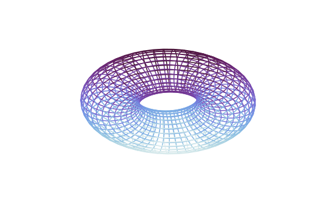

```julia
using Gnuplot
let
    U  = LinRange(-π,π, 50)
    V = LinRange(-π,π, 30)
    r = 0.5
    x = [1 + cos(u) + r * cos(u) * cos(v)  for u in U, v in V]
    y = [r * sin(v)                        for u in U, v in V]
    z = [sin(u) + r * sin(u) * cos(v)      for u in U, v in V]
    @gsp "set pm3d depthorder"
    @gsp :- "set style fill transparent solid 0.5"
    @gsp :- "set pm3d lighting primary 0.05 specular 0.2"
    @gsp :- x y z "w l palette notit" palette(:dense) "set view 108,2"
    @gsp :- "unset border" "set xyplane 0"
    @gsp :- "unset tics"
    @gsp :- "unset colorbox"
end
```


```
"assets/wires003.svg"
```




